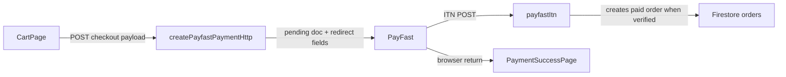

# Checkout inspection and remediation plan

## What “checkout” is in this codebase

Storefront checkout is implemented on **`/cart`** ([`frontend/src/pages/CartPage.jsx`](frontend/src/pages/CartPage.jsx)), not `/checkout`. Subscriptions use **`/subscriptions/checkout`** ([`frontend/src/pages/SubscriptionCheckoutPage.jsx`](frontend/src/pages/SubscriptionCheckoutPage.jsx)); invoice PayFast links use **`/account/subscriptions/pay/:invoiceId`** ([`frontend/src/pages/AccountSubscriptionPayPage.jsx`](frontend/src/pages/AccountSubscriptionPayPage.jsx)). PayFast callbacks land on **`/payment/success`** and **`/payment/cancel`** ([`frontend/src/pages/PaymentSuccessPage.jsx`](frontend/src/pages/PaymentSuccessPage.jsx)).



## Confirmed product bugs

### 1. Gift-card flag dropped from PayFast “pending session”

[`CartPage.jsx`](frontend/src/pages/CartPage.jsx) calls `setPayfastPendingSession` with `containsGiftCards`, but [`frontend/src/lib/payfastSession.js`](frontend/src/lib/payfastSession.js) **only persists** `paymentReference` and `createdAt`. [`PaymentSuccessPage.jsx`](frontend/src/pages/PaymentSuccessPage.jsx) reads `pendingSession.containsGiftCards`, so **gift-card-specific success copy never shows** despite the intentional branch.

**Fix:** Extend `setPayfastPendingSession` / `getPayfastPendingSession` typing and persisted JSON to include `containsGiftCards` (boolean), keeping backwards compatibility with older stored shapes.

### 2. Hard-coded EFT proof function URL

[`frontend/src/pages/EftSubmittedPage.jsx`](frontend/src/pages/EftSubmittedPage.jsx) POSTs proof metadata to production `attachEftPaymentProofHttp`, bypassing [`functionEndpoints.js`](frontend/src/lib/functionEndpoints.js). That contradicts emulator / `VITE_FUNCTIONS_BASE_URL` / `VITE_USE_LOCAL_FUNCTIONS` behaviour used for cart checkout and will fail or hit the wrong backend in non-production environments.

**Fix:** Add `getFunctionEndpoint("attachEftPaymentProofHttp")` (exported constant like other endpoints) and use it instead of `ATTACH_EFT_PROOF_URL`; optionally mirror EFT-order **fallback URL** parity if emulator routing is enabled.

### 3. Cart PayFast lacks the same emulator→cloud fallback as EFT

Cart EFT passes `fallbackUrl` in `postCheckoutRequest` ([`CartPage.jsx`](frontend/src/pages/CartPage.jsx) ~1089–1099). The PayFast branch (~1138–1147) uses only `PAYFAST_PAYMENT_FUNCTION_ENDPOINT` **without** `PAYFAST_PAYMENT_FUNCTION_FALLBACK_ENDPOINT` despite that constant existing in [`functionEndpoints.js`](frontend/src/lib/functionEndpoints.js). Local dev workflows are more brittle for card checkout than EFT.

**Fix:** Pass `fallbackUrl: PAYFAST_PAYMENT_FUNCTION_FALLBACK_ENDPOINT` for the PayFast `postCheckoutRequest` call.

## Behaviour that likely drives WhatsApp complaints (needs verification + tightening)

### 4. Cart clearing on `/payment/success` is strict and only reads query strings

[`PaymentSuccessPage.jsx`](frontend/src/pages/PaymentSuccessPage.jsx) clears the cart **only when** `payment_status === "COMPLETE"` appears in **`location.search`**. The page hero **always** says the payment succeeded, while cart state may remain if PayFast omits query params your build expects or uses different casing/keys depending on redirect mode/version.

**Plan:**

- Cross-check PayFast’s current **Return / redirect** parameters for hosted checkout ([PayFast developer docs](https://developers.payfast.co.za/)).
- Extend client parsing cautiously—for example accept common aliases you receive in production—and/or treat “returned from PayFast with `pf_payment_id` + pending session marker” as sufficient to clear cart **after** you confirm behaviour in sandbox.
- If PayFast POSTs back to SPA hosts (Firebase Hosting SPA rewrites swallow POST bodies), add a thin **Firebase Function redirect** endpoint that validates nothing critical on the browser (still rely on **`payfastItn`** for reconciliation) but normalizes GET params for `/payment/success`. Only implement once you verify POST vs GET behaviour.

### 5. PayFast ITN must return HTTP 200 for smooth customer return redirect

[`exports.payfastItn`](frontend/functions/index.js) returns non-200 in several branches (examples: unknown pending hash → **404**, missing passphrase → **400**, some validation-retry paths → **503**). Industry reports link **non-200 ITN responses** with **delayed or problematic redirect** after payment—increase in “PayFast hangs / checkout broken” chatter.

**Plan (ops + code review):**

- Confirm production env: `PAYFAST_NOTIFY_URL` points at the deployed `payfastItn`, passphrase matches mode (sandbox/live), and pending collection writes succeed.
- Decide policy: whether **paid-but-validation-failed** should still ACK 200 immediately (currently **503** in some retry cases at ~17249) to avoid customer-facing deadlock; reconcile risk vs UX with your accountant/stripe equivalents.

Reference (current strict cart clear logic):

```32:37:frontend/src/pages/PaymentSuccessPage.jsx
    const searchParams = new URLSearchParams(location.search);
    const paymentStatus = (searchParams.get("payment_status") || "").toString().trim().toUpperCase();
    if (paymentStatus !== "COMPLETE") return;
    clearCartRef.current();
    clearPayfastPendingSession();
```

## UX friction (often reported as “button doesn’t work”)

### 6. Errors may not associate with the primary CTA

On [`CartPage.jsx`](frontend/src/pages/CartPage.jsx), `handlePrimaryAction` validates and sets `orderError`, but errors render in **order summary** (~2130)—easy to miss on narrow viewports versus the sticky footer button (~2139–2146). **`handlePlaceOrder`** scrolls incomplete steps (~866–869) **only** after server-side precondition checks, not necessarily when **`handlePrimaryAction`** blocks.

**Fix:** When validation fails (`orderError` set from `validateStep` / `handlePrimaryAction`), **scroll/focus** the summary error or an `aria-live` banner near the CTA.

### 7. Courier configuration gap is a hard stop but already surfaced

[`CartPage.jsx`](frontend/src/pages/CartPage.jsx) shows **`No courier options are available…`** (~1828–1834). If Firestore courier rules omit a province, users genuinely cannot proceed—consistent with WhatsApp pings. Optionally add plain-language next step (**contact** link / WhatsApp) in that banner so they don’t feel the site is broken.

### 8. Fresh-flower WhatsApp copy is contextual, not a failure

Checkout surfaces [`FRESH_FLOWER_DELIVERY_NOTE`](frontend/src/lib/freshFlowerDelivery.js) and WhatsApp prompts in summary notices—these invite messages that are **informational**. Consider shortening or visually separating **“blocked” errors** vs **“heads-up” notices** after other fixes ship.

### 9. Profile save silently continues on `/cart`

Logged-in shoppers: `saveCustomerProfile` failure is **`console.warn` only** ([`CartPage.jsx`](frontend/src/pages/CartPage.jsx) ~1081–1085). Functional—order proceeds—but some users reopen account and conclude checkout “lost” saved address.

**Fix (light touch):** non-blocking toast or inline note (“Order placed; saved address couldn’t sync—retry from Account”) if save throws.

## Large orders (“massive” carts)

Why this aligns with reports: **`buildPayfastPaymentPayload`** persists the **full `items` array** (each with `metadata` copied from the client) onto **`pendingPayfastOrders`** ([`frontend/functions/index.js`](frontend/functions/index.js) ~11439–11446). **`createEftOrderHttp`** flows use the same pattern for EFT pending orders (~16484+).

- **Firestore hard limit:** one document ≤ **~1 MiB**. There is **no obvious line-item cap** in [`validateOrderPayload`](frontend/functions/index.js) (~9964+)—only “items non-empty”.
- Heavy `metadata` (many variants, repeats, preorder fields, custom blobs) multiplied by quantity of lines can blow the pending write → **opaque 500 / “Checkout service is temporarily unavailable”** after retries, or intermittent failures admins see only in logs—users revert to WhatsApp.

**Mitigation (pick one or combine):**

1. **Server:** Before `pendingRef.set`, **normalize/slim** each line item to only fields required for fulfilment, reconciliation, PayFast summaries, gift cards, and inventory — drop UI-only payloads.
2. **Server:** If serialized size exceeds a safe threshold, return **400** with a plain message (“Order is too large to complete online. Contact us…” / split orders) rather than failing deep in Firestore.
3. **Client:** Optionally send already-slim `items` in [`CartPage.jsx`](frontend/src/pages/CartPage.jsx) checkout payload matching the admin order shape (coordinate with `(1)` so nothing needed for fulfilment is stripped).
4. **Observability:** Log approximate JSON byte length (or Firestore-ready size) when creating PayFast/EFT pendings so you can correlate user reports.

PayFast-visible fields (`item_description` ~255 chars, etc.) are already truncated server-side (~11482–11486); **the fragile part is Firestore persistence of the cart**, not the PayFast POST field length.

## Mobile devices

Separate from correctness bugs, mobile amplifies UX and reliability issues:

- **Sticky CTA vs errors:** Summary column + sticky footer on [`CartPage.jsx`](frontend/src/pages/CartPage.jsx) (~2134–2146) means **`orderError` can sit far above** the thumb zone on phones—users tap “Place Order” repeatedly and say the button does not work—the error-visibility work in **section 6** should explicitly target **inline alert above the sticky bar**.
- **`CHECKOUT_REQUEST_TIMEOUT_MS` is 20s** with **`CHECKOUT_MAX_ATTEMPTS` is 2** ([`CartPage.jsx`](frontend/src/pages/CartPage.jsx) ~30–31). Large JSON bodies on slower uplinks (LTE, poor Wi‑Fi) disproportionately abort as **timeouts** (“temporarily unavailable”) even when the server is healthy.
- **Programmatic PayFast form submit** (~725–742) is usually fine but should be **verified on iOS Safari** (privacy / cross-site quirks are rare here but regression-test after changes).
- **Keyboard / viewport:** Long forms (shipping + accordion) increase abandon; pairing errors with sticky area reduces perceived “frozen” flows.

**Mitigation:** Duplicate critical `orderError` **adjacent to the sticky primary button**, add `scroll-margin`/safe-area for notched phones, optionally **scale timeout by payload size or `navigator.connection?.effectiveType`** (conservative heuristic), or show “Large order — this may take a moment” once item count exceeds a threshold.

## Mixed pre-order vs regular (“wrong” message, large carts, perceived dead clicks)

Today [`CartPage.jsx`](frontend/src/pages/CartPage.jsx) blocks checkout when **`hasMixedPreorderCart`** (~307–308), driven by **`isPreorderCartItem(item, resolveStock(item))`** (~294–302)—so the **client folds in live product/`resolveStock` state**.

The Cloud Function enforces the same separation via **`validatePreorderOrderSeparation`** ([`frontend/functions/index.js`](frontend/functions/index.js) ~6716–6724), but **`getItemPreorderDetails`** (~6678–6709) decides pre-order-ness from **payload line metadata (and pasted stock fields)—not a fresh read** of canonical `products` docs.

That mismatch means shoppers can **see a mixed-cart warning that feels false** (“I don’t have a pre-order”) or reach **Place order** believing they are fine and then hit **the same wording as a generic server error** after submit—often read as **“the button does nothing”.**

### Correctness layer

- **Goal:** One source of truth: either normalize line items server-side against **current product/variant** records before `validatePreorderOrderSeparation`, or **strip/refresh** stale `preorderSendMonth` / `stockStatus` on the client when live data says the line is no longer pre-order (and mirror that in the POST payload).
- Optional **“Recheck my cart”** control: re-run merge logic from Firestore `products` (same source as `productLookup`) and **rebuild per-line flags**; show a short **“Updated”** or **“Still blocked—see items below”** outcome so the click always **does something visible**.

### UX layer (what you asked for)

When the cart is blocked for mixed pre-order / separation:

1. **Identify offenders:** Derive two explicit lists (pre-order lines vs regular lines) using the **same** rule as the server after alignment—each cart row gets a **callout** (e.g. inset info box): *“Pre-order line—checkout pre-orders separately”* vs *“Regular line—remove or finish this order first”*, with **Remove** (and optional **“I’ll check out pre-orders next”** copy that explains clearing one group).
2. **Scroll + spotlight:** On **Continue / Recheck / first blocked submit**, **`scrollIntoView`** the **first offending row** (or a new **banner above the cart list** that lists offending product names); apply a temporary **outline / pulse / elevated card** class (CSS `@keyframes`) for **2–3s**—not relying on colour alone (`prefers-reduced-motion` respects reduced motion).
3. **Advance to checkout with feedback:** When the blocker is step-related (mixed cart resolved, or user removes items), programmatically **`scrollIntoView`** the **checkout accordion header** or **contact step** anchor, toggle **`is-active`/focus on the step heading**, and optionally use **`aria-live="polite"`** (“Checkout unlocked—starting at Contact”).
4. **Sticky CTA feedback:** Tie the same **`orderError`/success pulse** near the sticky **Continue / Place order** button so taps never feel silent on mobile—even if the viewport did not scroll as expected.

### Copy / policy

Explain **why** splitting exists (fulfilment / dispatch windows)—not “you might have…”—unless the line list is provisional. Prefer **deterministic**: *“These items ship on pre-order schedules; those ship from stock.*”*

## Subscriptions checkout (secondary to cart issues)

[`SubscriptionCheckoutPage.jsx`](frontend/src/pages/SubscriptionCheckoutPage.jsx): submit path is guarded and errors surface on the form (~888–892). Largest real-world failures are callable/config/Firestore rules—validate `createCustomerSubscription` deployment parity with production and copy `firebase.functions` regional settings if callers hit wrong region.

## Suggested verification checklist (manual / staging)

1. Sandbox PayFast hosted payment: succeed and land on **`/payment/success`** → capture URL (query vs hash vs POST relay). Confirm cart clears and session marker clears.
2. Force **province with no courier** → confirm UX is explicit and escalation path visible.
3. **Gift-card-only** PayFast checkout → verify success page shows gift-card email notice after persistence fix.
4. **EFT proof upload** against emulator/cloud base URL parity.
5. Tail **Cloud Functions logs** for `payfastItn` 404 / 400 during a test transaction.
6. **Stress test large cart:** many distinct lines + variants + gift cards — capture network tab payload size and confirm Firestore write succeeds / or new cap returns a readable error.
7. **Mobile Safari + Chrome Android** on throttled network (Fast 3G) for PayFast initiation and `/cart` POST timing.
8. **Mixed pre-order cart:** Line with stale metadata vs product switched to in-stock; confirm server + client agree after Recheck; verify scroll/highlight and `aria-live` announce on transition to checkout.

## Deliverables summary

| Area | Action |
|------|--------|
| Session | Persist `containsGiftCards` in payfast pending session helper |
| Endpoints | EFT proof + PayFast fallback use shared routing ([`functionEndpoints.js`](frontend/src/lib/functionEndpoints.js)) |
| Return URL | Align success-page parsing with actual PayFast return; consider redirect shim if POST |
| UX | Scroll/focus/live region for checkout validation errors; sticky-adjacent errors for mobile |
| Large orders | Slim pending payloads / size guard under Firestore 1 MiB; optional client slimming |
| Mobile | Timeout or messaging heuristics; safe-area around sticky checkout |
| Pre-order mix | Align detection client/server; Recheck + row callouts + step scroll/highlight + live region |
| Backend | Ops review ITN URLs / status codes vs PayFast redirect expectations |
