# POS Current Structure

## Summary

This document describes how the Bethany Blooms POS works today. It is intentionally current-state focused: it maps the existing routes, page responsibilities, data sources, Firestore writes, Cloud Functions, void flow, and cash-up flow as they exist in the repo now.

It is written as an engineering handoff. It also calls out concrete restructuring pressure points, but it does not propose a new design.

## Primary Implementation Surfaces

- `frontend/src/App.jsx`
  - Registers the POS routes:
    - `/admin/pos`
    - `/admin/pos/cash-up`
- `frontend/src/pages/admin/AdminLayout.jsx`
  - Exposes POS under the admin `Operations` navigation group.
- `frontend/src/pages/admin/AdminPosPage.jsx`
  - Main in-store sale workflow.
- `frontend/src/pages/admin/AdminPosCashUpPage.jsx`
  - Daily cash-up and receipt correction workflow.
- `frontend/src/components/admin/PosVoidDialog.jsx`
  - Shared modal used by both POS screens to void or correct receipts.
- `frontend/functions/index.js`
  - Contains the POS callables and backend reversal logic:
    - `adminSetPosPin`
    - `adminResetUserPosPin`
    - `adminVoidPosSale`
    - `lookupGiftCardByCode`
    - `sendPosReceipt`
- `frontend/src/pages/AdminPage.jsx`
  - Still contains the admin profile view used to configure a POS PIN.
- `frontend/src/pages/admin/AdminUsersView.jsx`
  - Allows an admin user's POS PIN to be reset.

## Route and Navigation Entry Points

### Admin routes

- `/admin/pos`
  - Main POS screen for creating in-person sales.
- `/admin/pos/cash-up`
  - Daily closeout screen for reviewing receipts, saving cash totals, downloading a PDF, and voiding receipts.
- `/admin/profile`
  - Not part of the sale flow, but this is where an admin sets or changes their POS PIN.

### How the user reaches POS

`AdminLayout.jsx` groups POS under `Operations`:

- `POS`
- `Cash Up`

This means the operational POS flow is split across:

1. Sale entry and checkout on `/admin/pos`
2. Reconciliation and post-sale correction on `/admin/pos/cash-up`
3. PIN readiness on `/admin/profile`
4. Optional PIN reset on `/admin/users`

## Data Sources Feeding the POS

### Shared admin inventory source

`AdminPosPage.jsx` reads most catalog and booking data from `useAdminData()`, which subscribes to:

- `products`
- `productCategories`
- `workshops`
- `bookings`
- `events`
- `cutFlowerBookings`
- `cutFlowerClasses`

`useAdminData()` also gates access through:

- `db`
- `inventoryEnabled`
- `inventoryLoading`
- `inventoryError`

If the current user is not an authenticated admin, the POS does not have inventory access.

### POS-specific live collections

`AdminPosPage.jsx` also subscribes directly to:

- `posProducts`
- `posSales`

`AdminPosCashUpPage.jsx` subscribes directly to:

- `posSales`
- `posCashups`

### Secondary consumers of POS data

POS sales are not only used by the POS pages. `AdminReportsPage.jsx` also reads `posSales` and uses the stored status and `voidSummary` to calculate POS revenue and void totals.

## Main POS Screen: `/admin/pos`

### Screen responsibilities

`AdminPosPage.jsx` currently owns all of the following:

- Item discovery and filtering
- In-memory cart building
- Workshop/class/booking selection and pre-editing
- POS-only product CRUD
- Gift card matching and cart injection
- Pricing calculations
- Payment selection and cash confirmation
- Receipt options
- Sale validation
- Firestore sale persistence
- Post-sale stock and booking side effects
- Optional receipt email trigger
- Printable receipt rendering
- Recent-sale void entry point

This is one of the main reasons the file is large and restructure pressure is high.

### Catalog tabs and what they read from

The POS item browser is organized into these tabs:

- `Products`
  - Uses `products`
  - Supports category filters and variant selection
- `POS-only`
  - Uses `posProducts`
  - These are studio-only items managed directly inside the POS page
- `Workshops`
  - Uses `workshops`
  - Supports session selection
- `Classes`
  - Uses `cutFlowerClasses`
  - Supports time slot and option selection
- `Bookings`
  - Uses:
    - `bookings`
    - `cutFlowerBookings`
  - Supports date filtering and inline editing before adding to cart
- `Events`
  - Uses `events`
  - Supports time slot selection
  - Currently adds zero-priced event lines unless pricing is introduced somewhere else

### Catalog normalization

Before rendering, the page normalizes each source into a POS-friendly shape:

- `products`
  - Resolves name, price, variants, tracked quantity, and stock status
- `posProducts`
  - Resolves name, price, tracked quantity, and stock status
- `workshops`
  - Resolves title, price, and normalized sessions
- `cutFlowerClasses`
  - Resolves title, base price, event date, slots, and options
- `bookings`
  - Resolves workshop title, session date, attendee count, price, and completion state
- `cutFlowerBookings`
  - Resolves event date, attendee count, attendee selections, estimated total, and completion state
- `events`
  - Resolves title, event date, and slots

The page excludes already completed bookings from the `Bookings` tab.

### Cart structure

Each cart line is an object with this effective shape:

```js
{
  key,
  sourceId,
  type,
  name,
  price,
  quantity,
  metadata
}
```

### Cart key behavior

`buildCartKey()` combines:

- item type
- source id
- variant id
- session id

This key is the merge identity for `handleAddToCart()`.

Implications:

- adding the same keyed item increments quantity
- changing the key inputs produces a separate line
- gift-card-linked lines are keyed so they can be removed when the gift card match is removed

### Supported cart line types

The current POS creates lines with these `type` values:

- `product`
- `pos-product`
- `workshop`
- `class`
- `workshop-booking`
- `cut-flower-booking`
- `event`
- `gift-card-redemption`

### Cart editing behavior

- Quantity can be increased or decreased for any line once in the cart.
- Manual removal is blocked for gift-card-linked lines.
  - Those lines are removed by removing the matched gift card.
- `resetCheckout()` clears:
  - cart
  - customer fields
  - notes
  - payment method
  - discount state
  - gift card state
  - cash state
  - checkout status/errors

### Booking handling inside POS

The `Bookings` tab is more than a picker. It also edits booking records before payment.

### Workshop bookings

For workshop bookings, the POS can update:

- session
- attendee count
- date

Changes are saved back to `bookings` before the booking is added to the cart.

### Cut flower bookings

For cut flower bookings, the POS can update:

- date
- attendee count
- selected option
- attendee-by-attendee option selections

Changes are saved back to `cutFlowerBookings` before the booking is added to the cart.

### Existing booking payment path

When an existing booking is added to the cart, the POS stores original booking state in line metadata, including:

- original status
- original paid flag
- original payment status
- original payment method

That metadata is later used by the void callable to restore the booking if the receipt is reversed.

### POS-only products

The POS page contains its own modal CRUD flow for `posProducts`.

Current capabilities:

- add POS-only product
- edit POS-only product
- delete POS-only product

These products are stored in the `posProducts` collection and are available only to the admin POS workflow.

## Pricing Model

Pricing is computed locally in `AdminPosPage.jsx`.

### Current pricing steps

1. `cartSubtotal`
   - Sum of `price * quantity` for all cart lines
2. `giftCardCoverableTotal`
   - Sum only for lines whose metadata marks them as gift-card-linked
3. `giftCardCreditTotal`
   - Sum of validated gift card values in `giftCardMatches`
4. `giftCardApplied`
   - `min(giftCardCreditTotal, giftCardCoverableTotal)`
5. `outOfPocketBeforeDiscount`
   - `cartSubtotal - giftCardApplied`
6. Discount
   - Either fixed amount or percent
   - Applied after gift card value is applied
7. `amountDue`
   - `outOfPocketBeforeDiscount - discountAmount`

### Discount behavior

Current discount modes:

- none
- amount
- percent

The discount is stored both as:

- raw discount metadata (`discount.type`, `discount.value`, `discount.amount`)
- calculated `netDiscountAmount`

### Cash handling

If payment method is `cash`:

- the page requires `cashReceived`
- calculates `changeDue`
- requires explicit confirmation through a modal before final checkout

If matched gift cards fully cover the amount due:

- payment is saved as `gift-card`
- manual payment method selection becomes informational only

## Gift Card Matching Flow

Gift card handling is tightly integrated into both cart mutation and pricing.

### Frontend flow

1. User toggles `Use gift card?`
2. User enters a code
3. `lookupGiftCardByCode` callable validates the code
4. If valid, the returned gift card is added to `giftCardMatches`
5. The POS injects one or more linked cart lines

### `lookupGiftCardByCode` backend behavior

The callable:

- requires admin auth
- normalizes the code
- loads the gift card from `giftCards`
- rejects archived cards
- rejects non-active cards
- rejects expired cards
- tries to resolve selected options from:
  - the gift card itself
  - the linked order
  - the gift card registry

Returned data includes the effective fields the POS uses:

- `id`
- `code`
- `status`
- `isExpired`
- `isActive`
- `giftCardMode`
- `catalogItemRef`
- `recipientName`
- `purchaserName`
- `value`
- `currency`
- `expiresAt`
- `selectedOptions`
- `selectedOptionsSummary`
- `selectedOptionCount`

### How gift cards inject cart lines

Current behavior has three branches:

1. Catalog-linked product gift card
   - Adds a `product` cart line for the product or variant referenced by the card
2. Gift card with selected options
   - Adds one or more `gift-card-redemption` lines
3. Fallback gift card
   - Adds a single fallback `gift-card-redemption` line using card value

### Removal behavior

Removing a matched gift card:

- removes the gift card from `giftCardMatches`
- removes all cart lines linked to that gift card id or code

## Sale Completion Flow

### Validation before checkout

Before writing anything, the page validates:

- cart is not empty
- customer email exists if email receipt is enabled
- cash is sufficient for cash payments
- enough stock exists for product or POS-only items

### Sale payload shape

Each completed sale writes one document to `posSales`.

Effective top-level fields written by the POS page:

```js
{
  receiptNumber,
  dateKey,
  status,
  createdBy,
  customer,
  paymentMethod,
  notes,
  items,
  subtotal,
  netSubtotal,
  giftCardApplied,
  netGiftCardApplied,
  giftCardCreditTotal,
  giftCardCoverableTotal,
  total,
  netTotal,
  discount,
  netDiscountAmount,
  voidSummary,
  cashReceived,
  changeDue,
  changeConfirmed,
  giftCardMatches,
  giftCardMatchedCount,
  createdAt,
  updatedAt
}
```

Each sale item stores:

- `lineId`
- `id`
- `sourceId`
- `name`
- `quantity`
- `voidedQuantity`
- `netQuantity`
- `price`
- `type`
- `metadata`

### Write order during checkout

### Phase 1: Firestore transaction

`AdminPosPage.jsx` opens a Firestore transaction and does two things atomically:

1. Creates the `posSales/{saleId}` document
2. Marks matched `giftCards/{giftCardId}` as redeemed

Gift cards are updated to:

- `status: "redeemed"`
- `isRedeemable: false`
- `redeemedAt`
- `redeemedByUid`
- `redeemedByEmail`
- `redemption.via = "pos"`
- `redemption.posSaleId`
- `redemption.receiptNumber`

### Phase 2: follow-up side effects outside the transaction

After the transaction succeeds, the page performs follow-up writes:

- stock updates
  - `products`
  - `posProducts`
- booking creation for newly sold workshop/class lines
  - `bookings`
  - `cutFlowerBookings`
- booking payment/completion updates for previously existing bookings
  - `bookings`
  - `cutFlowerBookings`
- optional receipt email via `sendPosReceipt`
- local receipt UI state for printing

### Stock updates

Checkout decrements stock after the sale is already written.

Current stock behavior:

- `product` base item
  - decrements top-level stock fields when tracked
- `product` variant
  - updates the matching entry inside `variants[]`
- `pos-product`
  - decrements tracked top-level stock fields

### Booking side effects

Newly sold `workshop` lines create new `bookings` records with a back-reference to the POS sale line.

Newly sold `class` lines create new `cutFlowerBookings` records with:

- status `confirmed`
- attendee count
- selected option metadata
- `posSaleId`
- `posSaleLineId`

Previously existing booking lines are updated to paid/completed or fulfilled.

### Optional receipt email

If the user checked `Email receipt to customer`, the page calls `sendPosReceipt`.

The callable:

- requires admin auth
- requires customer email
- sends the customer receipt email
- can optionally send an admin copy if requested by payload

### Printable receipt

If `Show printable receipt after sale` is checked:

- the page stores `receiptData` locally
- triggers `window.print()`
- renders a local printable receipt block in the page

## Current Flow Diagram

```mermaid
flowchart LR
  A["Admin opens /admin/pos"] --> B["Browse catalog tabs and bookings"]
  B --> C["Add items to cart"]
  C --> D["Optional gift card lookup injects linked lines"]
  D --> E["Local pricing: subtotal, gift card applied, discount, amount due"]
  E --> F["Checkout validations"]
  F --> G["Firestore transaction: create posSales sale + redeem gift cards"]
  G --> H["Follow-up writes: stock updates and booking create/update"]
  H --> I["Optional sendPosReceipt callable"]
  I --> J["Recent sales list"]
  J --> K["Void / Correct via adminVoidPosSale"]
  J --> L["/admin/pos/cash-up reads posSales"]
  K --> L
  L --> M["Save or re-save posCashups snapshot"]
```



## Void / Correction Flow

Void entry points exist in two places:

- `Recent sales` panel on `/admin/pos`
- POS sales table on `/admin/pos/cash-up`

Both open `PosVoidDialog.jsx`.

### Void dialog behavior

The dialog collects:

- full-sale or line-item mode
- reason
- admin PIN

It derives rules from normalized sale items.

### Current line-item rules

Partial quantity voids are allowed for:

- `product`
- `pos-product`

Whole-line-only voids are allowed for:

- `event`
- `workshop`
- `class`
- `workshop-booking`
- `cut-flower-booking`

### Gift card restriction

If a sale redeemed a gift card:

- line-item void is blocked
- only a full-sale void is allowed

This is enforced in both the dialog messaging and the backend callable.

### `adminVoidPosSale` backend behavior

`adminVoidPosSale` does the following:

1. Requires admin auth
2. Requires `saleId`
3. Requires a non-empty reason
4. Verifies the admin's POS PIN through `verifyAdminPosPin()`
5. Loads the sale and normalizes items
6. Computes updated item state and net totals
7. Writes a void record under `posSales/{saleId}/voids/{voidId}`
8. Updates the main `posSales/{saleId}` document
9. Marks affected cash-ups as `review-needed`

### Effective void subdocument fields

`posSales/{saleId}/voids/{voidId}` stores:

- `saleId`
- `receiptNumber`
- `mode`
- `reason`
- `voidedByUid`
- `voidedByEmail`
- `createdAt`
- `items`
- `grossAmountVoided`
- `discountAmountVoided`
- `giftCardAppliedVoided`
- `netAmountVoided`
- `giftCardAction`
- `cashupReviewTriggered`
- `saleStatusAfter`

### Sale updates after a void

The callable updates the parent sale with:

- updated `items`
- updated `status`
- updated `netSubtotal`
- updated `netDiscountAmount`
- updated `netGiftCardApplied`
- updated `netTotal`
- updated `voidSummary`
- updated `updatedAt`

### Side effects during a void

Inside the void transaction, the callable currently:

- restores stock for `product` and `pos-product` lines
- deletes linked workshop/class bookings created by the POS sale
- restores existing booking records to their original paid/status state
- reactivates gift cards if the sale used gift cards and the entire receipt ends up fully voided

### Cash-up review triggering

After the void transaction completes, the backend calls `markPosCashupsReviewNeeded()`.

That function:

- reloads current `posSales` for the sale date
- rebuilds live review totals
- finds `posCashups` matching the sale date
- updates those cash-up docs to:
  - `status: "review-needed"`
  - `reviewRequired: true`
  - `reviewReason`
  - `reviewTriggeredAt`
  - `reviewTriggeredByVoidId`
  - `reviewTriggeredByUid`
  - `reviewTriggeredByEmail`
  - `reviewCurrentTotals`

This means a saved cash-up is treated as a stale snapshot after a later void.

## POS PIN dependencies

Voiding depends on an admin PIN, but PIN setup does not live in the POS screen itself.

### PIN configuration path

`adminSetPosPin`:

- is called from the admin profile UI
- stores hashed credentials in backend-only `adminPosCredentials`
- stores readable status metadata in `adminPosSettings`

### PIN reset path

`adminResetUserPosPin`:

- is called from the admin users screen
- deletes the stored credentials
- marks the user's `adminPosSettings.pinConfigured` as false

### Readable vs backend-only storage

- `adminPosSettings`
  - readable to admin / self per Firestore rules
  - used by the frontend to show whether a PIN exists
- `adminPosCredentials`
  - denied to frontend by Firestore rules
  - used only by Cloud Functions for hash/salt verification and lockout tracking

## Cash-Up Flow: `/admin/pos/cash-up`

`AdminPosCashUpPage.jsx` is a live operational summary plus a snapshot writer.

### Data inputs

The page reads:

- `posSales`
- `posCashups`

It then filters by the selected date.

### Live totals model

The page recomputes daily totals from `posSales`.

Current totals logic:

- `cashTotal`
  - sum of active sales where payment method is `cash`
- `cardTotal`
  - sum of active sales where payment method is `card`
- `discountTotal`
  - sum of sale `netDiscountAmount`
- `total`
  - sum of active sale `netTotal`
- `count`
  - active sale count
- `voidedCount`
  - number of sales whose `voidedTotal > 0`
- `voidedTotal`
  - sum of `voidSummary.voidedTotal`

Fully voided sales are excluded from active count and active payment totals.

### Cash-up save behavior

Saving a cash-up writes one document to `posCashups` with effective fields:

```js
{
  date,
  dateKey,
  openingFloat,
  cashCounted,
  expectedCash,
  variance,
  totals: {
    cash,
    card,
    discounts,
    total,
    count,
    voidedCount,
    voidedTotal
  },
  notes,
  status,
  reviewRequired,
  reviewReason,
  reviewTriggeredAt,
  reviewTriggeredByVoidId,
  reviewTriggeredByUid,
  reviewTriggeredByEmail,
  reviewCurrentTotals,
  updatedAt,
  updatedBy,
  createdAt,
  createdBy
}
```

### Save/update modes

- If editing an existing cash-up for the selected date, the page updates that document.
- If no cash-up exists yet, it creates a new one.

### PDF export

The page can export a PDF summary of a saved cash-up.

The PDF builder uses:

- saved cash-up totals
- or `reviewCurrentTotals` when the cash-up is flagged for review
- plus current sales for the selected date

### Why cash-ups go stale

Cash-ups are saved snapshots, but voids recalculate reality later.

Current behavior:

- a sale is saved
- a cash-up is saved
- a later void changes `posSales`
- backend flags the cash-up for review
- an admin must manually open the cash-up and save it again to clear the review flag

## Current Public Operational Interfaces

### Admin routes

- `/admin/pos`
- `/admin/pos/cash-up`

### Firestore collections used directly by the POS flow

- `posSales`
- `posSales/{saleId}/voids`
- `posCashups`
- `posProducts`
- `giftCards`
- `bookings`
- `cutFlowerBookings`
- `cutFlowerClasses`
- `products`
- `productCategories`
- `workshops`
- `events`
- `adminPosSettings`

### Backend-only supporting collection

- `adminPosCredentials`

### Callable functions

- `lookupGiftCardByCode`
- `sendPosReceipt`
- `adminVoidPosSale`
- `adminSetPosPin`
- `adminResetUserPosPin`

## Validation Scenarios This Structure Supports Today

- Normal sale with product or POS-only items
- Sale containing workshop/class/event lines
- Existing booking paid through POS
- Gift card lookup and redemption path
- Discounted sale
- Cash sale with change confirmation
- Receipt email and printable receipt behavior
- Full-sale void
- Line-item void
- Gift-card sale full-void restriction and gift card reactivation
- Cash-up creation
- Cash-up edit
- Cash-up PDF export
- Cash-up review-needed state after voids

## Other Current-State Notes

- The `Recent sales` panel on `/admin/pos` is not a full receipt history.
  - It only shows receipts for the current date key.
  - It caps the visible list to the most recent 12 sales.
- The cash-up screen is the broader correction surface.
  - It shows all receipts for the selected day and can open the same void dialog.

## Pain Points / Restructuring Pressure

These are current implementation pressures, not redesign proposals.

### 1. One page owns too many responsibilities

`AdminPosPage.jsx` combines catalog UI, booking editing, cart logic, pricing, payment handling, Firestore persistence, stock mutation, booking side effects, gift card handling, receipt generation, and sale correction entry points in one component.

This makes the sale flow hard to reason about and hard to change safely.

### 2. Checkout has a split consistency boundary

Only these actions are in the initial Firestore transaction:

- create `posSales`
- redeem `giftCards`

These actions happen afterward:

- stock updates
- booking creation
- booking status updates
- receipt email

If a post-transaction step fails, the sale can already exist while downstream stock or booking state is only partially updated.

### 3. Gift card logic is tightly coupled to cart mutation

Gift card matching does not only affect pricing. It also injects or removes cart lines directly. That means:

- pricing behavior depends on metadata on cart lines
- removing a gift card mutates cart composition
- the sale flow and the gift card data model are tightly coupled

### 4. Cash-up is a snapshot layered on top of live sales

`posCashups` is not the source of truth for totals. `posSales` is.

Because of that:

- saved cash-ups can become stale
- voids do not automatically rebuild the cash-up snapshot
- an admin must reopen and save again to clear review state

### 5. Void readiness depends on screens outside the POS flow

Voiding requires a POS PIN, but PIN setup lives in the profile screen and PIN reset lives in the users screen.

Operationally, that means a cashier can reach `Void / Correct` and still be blocked because prerequisite setup is elsewhere.

### 6. Stock mutation is not symmetrical across checkout and void

Current checkout stock handling is more detailed than current void handling.

Observed asymmetries:

- checkout can decrement variant stock inside `products.variants[]`
- the void callable restores `quantity` on the parent product or POS product document, not the variant entry
- checkout writes `stock_quantity`, `stockQuantity`, or `quantity` depending on source shape
- the void callable restores only `quantity`

This means the reversal path is not a clean mirror of the sale path for inventory-tracked items.

### 7. The POS depends on multiple collection-specific behaviors

The current flow contains collection-specific business rules for:

- products
- POS-only products
- workshops
- classes
- events
- workshop bookings
- cut flower bookings
- gift cards
- cash-ups

That makes the checkout pipeline branch-heavy and harder to modularize later.

## Final Current-State Takeaway

The current POS is functional, but it is implemented as a tightly coupled operational workflow:

- UI state, pricing, and persistence are concentrated in `AdminPosPage.jsx`
- true source-of-truth sale data lives in `posSales`
- cash-up is a derived administrative snapshot
- voiding is backend-enforced and PIN-gated
- gift cards are both a pricing input and a cart-construction mechanism

Any future restructure should start from these boundaries, because this is where the current flow is carrying the most complexity.
